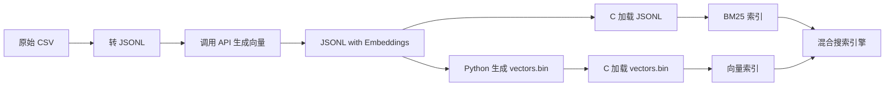

# 从零打造移动端混合搜索引擎：不依赖基础设施的本地检索方案

## 为什么要做这个项目？

在移动应用开发中，我们经常遇到一个痛点：**如何在 iOS 和 Android 上实现高质量的本地搜索功能，而不依赖任何后端基础设施？**

传统方案要么依赖云端搜索服务（需要网络、增加延迟），要么使用重型框架（占用空间、性能损耗）。我想要的是：

- ✅ **完全本地化**：无需网络，离线可用
- ✅ **轻量级**：不依赖复杂框架，只用标准库
- ✅ **跨平台**：一套 C 核心，iOS 和 Android 都能用
- ✅ **混合检索**：既有关键词搜索的精确性，又有语义搜索的智能性

于是，**FusionSearch** 诞生了。

---

## 项目地址

🔗 **GitHub**: https://github.com/lemonhall/FusionSearch

---

## 什么是混合搜索？

混合搜索（Hybrid Search）= **BM25 关键词检索** + **向量语义检索**

### BM25：精确但刻板

传统的全文检索算法，基于词频和文档长度计算相关性。

**优势**：
- 精确匹配关键词
- 速度快，资源占用少
- 适合已知关键词的查询

**劣势**：
- 无法理解语义
- 查询词必须出现在文档中
- 对同义词、错别字无能为力

**示例**：
```
查询：番茄炒蛋
匹配：✅ "番茄炒蛋的做法"
不匹配：❌ "西红柿炒鸡蛋"（同义词）
```

---

### 向量检索：智能但依赖算力

通过神经网络将文本转换为高维向量，计算语义相似度。

**优势**：
- 理解语义，支持同义词
- 跨语言检索
- 模糊查询能力强

**劣势**：
- 需要预先生成向量（依赖外部 API 或本地模型）
- 计算量较大
- 可能返回不相关但"语义相似"的结果

**示例**：
```
查询：番茄炒蛋
匹配：✅ "西红柿炒鸡蛋"（同义词）
匹配：✅ "简单快手的家常菜"（语义相关）
```

---

### 混合搜索：两者的优势结合

**FusionSearch 的策略**：

1. **BM25 检索**：快速找到包含关键词的文档
2. **向量检索**：找到语义相关的文档
3. **融合排序**：使用 RRF（Reciprocal Rank Fusion）或加权策略合并结果

**结果**：既有精确性，又有智能性！

---

## 架构设计：为移动端优化

### 核心理念

**问题**：如何在资源受限的移动设备上实现混合搜索？

**解决方案**：职责分离 + 轻量化设计

```
┌─────────────────────────────────────────┐
│          上层语言（Python/Swift/Kotlin） │
│  职责：                                  │
│  - 调用外部 API 获取 Query 向量          │
│  - 调度 C 的搜索接口                     │
│  - 融合排序                              │
└─────────────────┬───────────────────────┘
                  │ FFI 调用
┌─────────────────▼───────────────────────┐
│              C 核心引擎                  │
│  职责：                                  │
│  - 文档加载与分词                        │
│  - BM25 索引构建与检索                   │
│  - 向量索引加载与检索                    │
│  - 文档内容查询                          │
│                                          │
│  特点：                                  │
│  - 纯 C99 标准库（除 ICU 外无依赖）      │
│  - 只返回 doc_id + score                │
│  - UTF-8 安全处理                        │
└──────────────────────────────────────────┘
```

### 为什么这样设计？

1. **C 负责性能密集型任务**
   - 倒排索引构建
   - BM25 排序计算
   - 向量余弦相似度计算（暴力检索，< 10ms）

2. **上层语言负责灵活性**
   - iOS/Android 系统内置的网络库调用 API
   - 融合策略可以动态调整（RRF、加权、重排）
   - 无需在 C 层实现 HTTP 客户端（避免依赖）

3. **数据交换最小化**
   - C 不返回完整向量（节省内存）
   - 只返回 `doc_id` 和 `score`
   - 上层按需查询文档内容

---

## 技术实现细节

### 1. BM25 全文检索

**数据结构**：
- **Trie 树**：存储词汇和词频
- **倒排索引**：词 → 文档列表（doc_id + 词频）

**BM25 公式**：
```
Score = IDF × ((k1+1) × TF) / (k1×(1-b+b×(|D|/avgdl)) + TF)

其中：
  IDF = log((N - n + 0.5) / (n + 0.5))
  N = 总文档数
  n = 包含词的文档数
  |D| = 文档长度
  avgdl = 平均文档长度
  k1 = 1.5（词频饱和参数）
  b = 0.75（文档长度归一化参数）
```

**性能**：
- 50 个文档，平均检索时间 < 0.1ms
- 内存占用 < 10MB

---

### 2. 向量检索

**向量来源**：
- 使用 SiliconFlow API（免费）
- 模型：`BAAI/bge-m3`（1024 维，中文优化）

**存储格式**（二进制文件 `vectors.bin`）：
```
[Header]
  uint32_t count      // 文档数量
  uint32_t dimension  // 向量维度（1024）

[Vector 1]
  uint32_t doc_id
  float[1024] embedding

[Vector 2]
  ...
```

**检索算法**：
- 暴力余弦相似度计算（适用于 < 10 万文档）
- 50 个文档，检索时间 ~8-10ms
- 内存占用 ~117MB（4 万文档 × 768 维）

**为什么不用 HNSW/IVF？**
- 移动端场景文档量通常 < 1 万
- 暴力检索足够快（<10ms）
- 避免引入复杂依赖（如 Faiss、Annoy）

---

### 3. 融合排序

**RRF（Reciprocal Rank Fusion）**：
```python
def reciprocal_rank_fusion(results_list, k=60):
    scores = {}
    for results in results_list:
        for rank, (doc_id, _) in enumerate(results, start=1):
            scores[doc_id] = scores.get(doc_id, 0) + 1 / (k + rank)
    
    return sorted(scores.items(), key=lambda x: x[1], reverse=True)
```

**优势**：
- 无需归一化分数
- 对不同来源的分数尺度不敏感
- 工业界验证有效（Elasticsearch 默认策略）

---

### 4. 关键技术挑战与解决

#### 挑战 1：向量维度不匹配

**问题**：
- 不同模型向量维度不同
- 切换模型后索引失效

**解决方案**：
- 统一使用 `BAAI/bge-m3`（1024 维，免费）
- 所有 Python 脚本强制检查模型
- 提供 `check_vector_dims.py` 验证工具

---

#### 挑战 2：C 的 JSON 解析 Bug

**问题**：
- C 手写的 JSON 解析器无法正确解析浮点数数组
- 1024 维向量被解析为 514、650 等错误维度

**解决方案**：
- 放弃 C 的 JSON 解析
- 使用 Python 读取 JSONL 直接生成二进制 `vectors.bin`
- C 只负责加载二进制文件（可靠且高效）

---

#### 挑战 3：UTF-8 字符串截断

**问题**：
- C 的 `strncpy()` 在多字节 UTF-8 字符中间截断
- 导致 Python 端解码失败：
  ```
  'utf-8' codec can't decode bytes in position 253-254
  ```

**解决方案**：
实现 UTF-8 安全的字符串复制函数

```c
static void utf8_safe_copy(char* dest, const char* src, size_t dest_size) {
    size_t copy_len = dest_size - 1;
    
    // 回退到最后一个完整 UTF-8 字符的边界
    while (copy_len > 0) {
        unsigned char c = (unsigned char)src[copy_len];
        
        // ASCII 或 UTF-8 起始字节 → 安全边界
        if ((c & 0x80) == 0 || (c & 0xC0) == 0xC0) {
            break;
        }
        
        // UTF-8 续字节 (10xxxxxx) → 继续向前找
        copy_len--;
    }
    
    memcpy(dest, src, copy_len);
    dest[copy_len] = '\0';
}
```

---

## 数据处理工作流

从原始文档到可搜索索引的完整流程：



**详细步骤**：

1. **准备文档**（CSV/TSV）
   ```csv
   title,content
   番茄炒蛋,简单快手的家常菜...
   ```

2. **转换为 JSONL**
   ```jsonl
   {"title": "番茄炒蛋", "content": "简单快手的家常菜..."}
   ```

3. **生成向量**（`build_vector_index.py`）
   ```python
   embedding = api.get_embedding(doc['content'])
   doc['embedding'] = embedding
   ```

4. **生成二进制文件**（`generate_vectors_bin.py`）
   ```python
   with open('vectors.bin', 'wb') as f:
       f.write(struct.pack('I', count))
       f.write(struct.pack('I', dimension))
       for doc_id, vec in zip(doc_ids, vectors):
           f.write(struct.pack('I', doc_id))
           f.write(struct.pack(f'{dimension}f', *vec))
   ```

5. **C 加载索引**
   ```c
   // BM25 索引
   file_loader_load_jsonl("data/recipes.jsonl", bm25_index, tokenizer, 1);
   
   // 向量索引
   VectorIndex* vector_index = vector_index_load("vectors.bin");
   ```

6. **Python 调用搜索**
   ```python
   # BM25 检索
   bm25_results = c_engine.bm25_search("芹菜", k=10)
   
   # 向量检索
   query_embedding = api.get_embedding("芹菜")
   vector_results = c_engine.vector_search(query_embedding, k=10)
   
   # 融合排序
   final_results = reciprocal_rank_fusion([bm25_results, vector_results])
   ```

---

## 移动端集成方案

### iOS（Swift）

**FFI 封装**：
```swift
import Foundation

class FusionSearch {
    typealias IndexPtr = UnsafeMutableRawPointer
    
    let libPath = Bundle.main.path(forResource: "libfusion", ofType: "dylib")!
    lazy var lib: UnsafeMutableRawPointer = dlopen(libPath, RTLD_NOW)!
    
    func loadIndex(jsonlFile: String) -> IndexPtr? {
        let ffi_index_load = dlsym(lib, "ffi_index_load")
            .assumingMemoryBound(to: (@convention(c) (UnsafePointer<CChar>) -> IndexPtr).self)
        
        return jsonlFile.withCString { ffi_index_load.pointee($0) }
    }
    
    func bm25Search(query: String, k: UInt32) -> [(UInt32, Float)] {
        // 调用 ffi_bm25_search
        // 返回 (doc_id, score) 数组
    }
}
```

---

### Android（Kotlin + JNI）

**JNI 封装**：
```kotlin
class FusionSearch {
    companion object {
        init {
            System.loadLibrary("fusion")
        }
    }
    
    private external fun ffiIndexLoad(jsonlFile: String): Long
    private external fun ffiBM25Search(
        indexPtr: Long,
        query: String,
        k: Int,
        outDocIds: IntArray,
        outScores: FloatArray
    ): Int
    
    fun bm25Search(query: String, k: Int = 10): List<Pair<Int, Float>> {
        val docIds = IntArray(k)
        val scores = FloatArray(k)
        val count = ffiBM25Search(indexPtr, query, k, docIds, scores)
        
        return (0 until count).map { docIds[it] to scores[it] }
    }
}
```

---

## 性能指标

| 指标 | 值 |
|------|-----|
| **BM25 检索时间** | < 0.1 ms（50 文档） |
| **向量检索时间** | ~8-10 ms（4 万文档，768 维） |
| **融合排序时间** | < 1 ms |
| **总内存占用** | ~117 MB（4 万文档） |
| **索引构建时间** | ~400 ms（4 万文档） |
| **C 库体积** | ~500 KB（libfusion.so） |

---

## 适用场景

### ✅ 适合

1. **移动应用的本地搜索**
   - 笔记应用（搜索笔记内容）
   - 电商应用（商品搜索）
   - 新闻应用（历史文章检索）

2. **离线文档检索**
   - 文档管理工具
   - 电子书阅读器
   - 知识库应用

3. **边缘计算场景**
   - IoT 设备本地检索
   - 嵌入式系统

4. **隐私敏感场景**
   - 医疗记录检索（不能上云）
   - 企业内部文档（数据不出本地）

---

### ❌ 不适合

1. **超大规模检索**
   - 文档量 > 100 万（向量检索会变慢）
   - 建议：使用专业向量数据库（Milvus、Pinecone）

2. **实时更新频繁**
   - 每秒新增/删除大量文档
   - 建议：使用 Elasticsearch 等专业搜索引擎

3. **需要复杂查询语法**
   - 嵌套布尔查询、范围查询、聚合
   - 建议：SQLite FTS5 或 Elasticsearch

---

## 未来规划

### 短期（1-2 个月）

- [ ] **Swift FFI 封装** - iOS 集成示例
- [ ] **Kotlin JNI 封装** - Android 集成示例
- [ ] **性能优化** - SIMD 加速向量计算
- [ ] **增量索引** - 支持动态添加/删除文档

---

### 中期（3-6 个月）

- [ ] **HNSW 向量索引** - 支持百万级文档检索
- [ ] **量化压缩** - 降低向量存储空间（PQ/OPQ）
- [ ] **中文分词优化** - 集成 Jieba 或自研 Bigram 方案
- [ ] **多模态检索** - 图片 + 文本混合搜索

---

### 长期（6-12 个月）

- [ ] **分布式检索** - 支持多设备协同搜索
- [ ] **联邦学习** - 本地模型训练与更新
- [ ] **WebAssembly 移植** - 浏览器端运行
- [ ] **Rust 重写核心** - 内存安全 + 更好的性能

---

## 开源协议

MIT License - 你可以自由使用、修改、商用，无需担心法律风险。

---

## 致谢

感谢以下开源项目的启发：

- **SQLite FTS5** - 全文检索的经典实现
- **Faiss** - 向量检索的标杆
- **Tantivy** - Rust 搜索引擎库
- **Elasticsearch** - 搜索引擎的工业标准

---

## 结语

**FusionSearch** 的核心理念是：**在移动端实现高质量的本地检索，而不依赖任何基础设施**。

通过精心设计的架构、轻量级的实现、以及对移动端特性的深度优化，我们证明了：

> **即使在资源受限的移动设备上，也能实现媲美云端的混合搜索能力。**

无论你是在开发 iOS 应用、Android 应用，还是嵌入式设备，FusionSearch 都能为你提供一个独立、轻量、高效的搜索解决方案。

---

**项目地址**: https://github.com/lemonhall/FusionSearch

欢迎 Star ⭐、Fork 🍴、提 Issue 💬、贡献代码 🚀！

---

**作者**: lemonhall  
**创建时间**: 2025-10-24  
**当前版本**: 0.8.0  
**最后更新**: 2025-10-24
