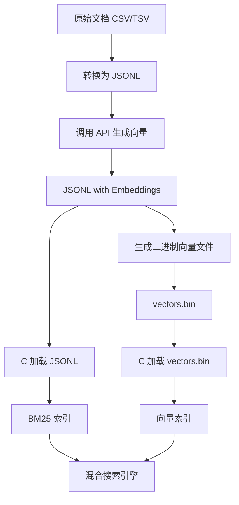

# 混合搜索引擎数据处理工作流

本文档详细记录了从原始文档到可搜索索引的完整数据处理流程。

---

## 📋 工作流概览



---

## 🔄 详细步骤

### Step 1: 准备原始文档

**输入格式**：CSV、TSV 或纯文本

**示例** (`recipes.csv`):
```csv
title,content
番茄炒蛋,简单快手的家常菜，鸡蛋打散炒熟备用...
宫保鸡丁,经典川菜，鸡肉切丁腌制...
```

**文件位置**：`data/recipes.csv`

---

### Step 2: 转换为 JSONL 格式

**工具**：手动转换或使用 Python 脚本

**输出格式** (JSON Lines):
```jsonl
{"title": "番茄炒蛋", "content": "简单快手的家常菜，鸡蛋打散炒熟备用..."}
{"title": "宫保鸡丁", "content": "经典川菜，鸡肉切丁腌制..."}
```

**Python 转换脚本示例**:
```python
import csv
import json

with open('data/recipes.csv', 'r', encoding='utf-8') as f_in:
    with open('data/recipes.jsonl', 'w', encoding='utf-8') as f_out:
        reader = csv.DictReader(f_in)
        for row in reader:
            json.dump(row, f_out, ensure_ascii=False)
            f_out.write('\n')
```

**文件位置**：`data/recipes.jsonl`

---

### Step 3: 调用 API 生成向量

**工具**：`build_vector_index.py`

**功能**：
- 读取 JSONL 文件
- 调用 SiliconFlow Embedding API
- 为每个文档生成 1024 维向量
- 输出带向量的 JSONL 文件

**使用方法**:
```bash
# 设置 API 密钥
export SILICONFLOW_API_KEY='your-api-key-here'

# 运行脚本
python build_vector_index.py
```

**核心代码逻辑**:
```python
# 读取原始 JSONL
with open('data/recipes.jsonl', 'r') as f:
    for line in f:
        doc = json.loads(line)
        
        # 调用 API 生成向量
        embedding = get_embedding(doc['content'])
        
        # 添加向量字段
        doc['embedding'] = embedding
        
        # 写入新文件
        output.write(json.dumps(doc, ensure_ascii=False) + '\n')
```

**输出格式** (`recipes_vector.jsonl`):
```jsonl
{"title": "番茄炒蛋", "content": "简单快手的家常菜...", "embedding": [0.123, -0.456, 0.789, ...]}
{"title": "宫保鸡丁", "content": "经典川菜...", "embedding": [0.234, 0.567, -0.123, ...]}
```

**关键参数**:
- **模型**: `BAAI/bge-m3`（1024 维，免费）
- **API**: SiliconFlow Embedding API
- **向量维度**: 1024

**文件位置**：`data/recipes_vector.jsonl`

---

### Step 4: 生成二进制向量文件

**工具**：`generate_vectors_bin.py`

**为什么需要这一步？**
> C 的 JSON 解析存在 Bug，无法正确解析 JSONL 中的浮点数数组。  
> 因此使用 Python 直接读取 JSONL 并生成二进制文件，C 直接加载二进制文件。

**使用方法**:
```bash
python generate_vectors_bin.py
```

**核心逻辑**:
```python
import struct
import json

vectors = []
doc_ids = []

# 读取 JSONL 中的向量
with open('data/recipes_vector.jsonl', 'r') as f:
    for i, line in enumerate(f, start=1):
        doc = json.loads(line)
        vectors.append(doc['embedding'])
        doc_ids.append(i)

# 写入二进制文件
with open('vectors.bin', 'wb') as f:
    count = len(vectors)
    dimension = len(vectors[0])
    
    # 头部：文档数量 + 向量维度
    f.write(struct.pack('I', count))      # uint32_t count
    f.write(struct.pack('I', dimension))  # uint32_t dimension
    
    # 每个向量：doc_id + embedding
    for doc_id, vec in zip(doc_ids, vectors):
        f.write(struct.pack('I', doc_id))           # uint32_t doc_id
        f.write(struct.pack(f'{dimension}f', *vec)) # float embedding[dimension]
```

**二进制文件格式**:
```
[Header]
  uint32_t count      // 文档数量（如 50）
  uint32_t dimension  // 向量维度（如 1024）

[Vector 1]
  uint32_t doc_id     // 文档ID（1）
  float[1024]         // 向量数据

[Vector 2]
  uint32_t doc_id     // 文档ID（2）
  float[1024]         // 向量数据

...
```

**文件位置**：`vectors.bin`  
**文件大小**：约 201 KB（50 个文档 × 1024 维 × 4 字节）

---

### Step 5: C 加载索引文件

**C 端加载两个文件**:

1. **`data/recipes_vector.jsonl`** → BM25 索引
   - 解析 `title` 和 `content` 字段
   - 分词并构建倒排索引
   - 忽略 `embedding` 字段

2. **`vectors.bin`** → 向量索引
   - 读取二进制向量数据
   - 构建向量索引（doc_id → embedding）

**加载代码** (C):
```c
// 加载 BM25 索引
InvertedIndex* bm25_index = index_create();
Tokenizer* tokenizer = tokenizer_create(NULL);
file_loader_load_jsonl(
    "data/recipes_vector.jsonl",
    bm25_index,
    tokenizer,
    1  // 起始 doc_id
);

// 加载向量索引
VectorIndex* vector_index = vector_index_load("vectors.bin");
```

---

### Step 6: Python 调用 C 搜索接口

**工具**：`fusion_search.py`

**Python 调度流程**:

```python
# 1. 初始化 C 库
c_engine = CFusionSearch("./libfusion.so")
c_engine.load_index("data/recipes_vector.jsonl")
c_engine.load_vector_index("vectors.bin")

# 2. 用户输入查询
query = "芹菜"

# 3. BM25 关键词搜索
bm25_results = c_engine.bm25_search(query, k=10)
# 返回: [(doc_id, score), ...]

# 4. 调用 API 获取 Query 向量
api = EmbeddingAPI()
query_embedding = api.get_embedding(query)

# 5. 向量语义搜索
vector_results = c_engine.vector_search(query_embedding, k=10)
# 返回: [(doc_id, similarity), ...]

# 6. 融合排序
final_results = reciprocal_rank_fusion(bm25_results, vector_results)

# 7. 查询文档内容
for doc_id, score in final_results[:10]:
    doc = c_engine.get_document(doc_id)
    print(f"标题: {doc['title']}")
    print(f"内容: {doc['content']}")
    print(f"评分: {score}")
```

**FFI 调用关系**:
```
Python                           C (libfusion.so)
  |                                    |
  |--- ffi_index_load() ------------>  加载 JSONL → BM25 索引
  |--- ffi_vector_index_load() ---->  加载 vectors.bin → 向量索引
  |                                    |
  |--- ffi_bm25_search() ----------->  BM25 检索 → (doc_id, score)[]
  |--- ffi_vector_search() --------->  向量检索 → (doc_id, similarity)[]
  |                                    |
  |--- ffi_get_document() ---------->  查询文档内容 (UTF-8 安全)
```

---

## 🛠️ 关键技术点

### 1. 向量维度统一

**问题**：不同模型向量维度不同

**解决方案**：
- 统一使用 `BAAI/bge-m3` 模型（1024 维，免费）
- 所有脚本检查并强制使用该模型
- 验证脚本：`check_vector_dims.py`

```python
# 检查所有向量维度
python check_vector_dims.py data/recipes_vector.jsonl
```

---

### 2. JSON 解析问题

**问题**：C 的 `parse_json_embedding()` 函数无法正确解析浮点数数组

**现象**：
- JSONL 文件中向量是 1024 维
- C 解析后得到 514、650、648 等错误维度
- 生成的 `vectors.bin` 只有 8 字节（空文件）

**解决方案**：
- **放弃 C 的 JSON 解析**
- 使用 Python 的 `json.loads()` 读取 JSONL
- Python 直接生成二进制文件
- C 只负责加载二进制文件（可靠且高效）

---

### 3. UTF-8 字符串截断

**问题**：C 的 `strncpy()` 在多字节 UTF-8 字符中间截断

**错误示例**：
```
'utf-8' codec can't decode bytes in position 253-254: unexpected end of data
```

**原因**：
- 标题缓冲区 256 字节
- `strncpy()` 在第 254 字节截断
- 恰好截断了一个 3 字节的中文字符

**解决方案**：实现 UTF-8 安全的复制函数

```c
// UTF-8 安全的字符串复制
static void utf8_safe_copy(char* dest, const char* src, size_t dest_size) {
    if (dest_size == 0) return;
    
    size_t src_len = strlen(src);
    if (src_len < dest_size) {
        strcpy(dest, src);
        return;
    }
    
    // 在 UTF-8 字符边界截断
    size_t copy_len = dest_size - 1;
    while (copy_len > 0) {
        unsigned char c = (unsigned char)src[copy_len];
        
        // ASCII 或 UTF-8 起始字节 → 安全边界
        if ((c & 0x80) == 0 || (c & 0xC0) == 0xC0) {
            break;
        }
        
        // UTF-8 续字节 (10xxxxxx) → 继续向前找
        copy_len--;
    }
    
    memcpy(dest, src, copy_len);
    dest[copy_len] = '\0';
}
```

**UTF-8 字节格式**:
```
ASCII:       0xxxxxxx          (1 字节)
UTF-8 2字节: 110xxxxx 10xxxxxx
UTF-8 3字节: 1110xxxx 10xxxxxx 10xxxxxx (中文)
UTF-8 4字节: 11110xxx 10xxxxxx 10xxxxxx 10xxxxxx
```

---

### 4. 共享库编译

**问题**：编译共享库时报错

**错误信息**:
```
relocation R_X86_64_PC32 against symbol `stderr@@GLIBC_2.2.5' 
can not be used when making a shared object
```

**原因**：未使用位置无关代码（PIC）

**解决方案**：Makefile 添加 `-fPIC` 标志

```makefile
# Makefile
lib: CFLAGS += -fPIC
lib: $(OBJS)
	$(CC) -shared $(OBJS) -o libfusion.so $(LDFLAGS)
```

**编译命令**:
```bash
# WSL/Linux
wsl bash -c "cd /mnt/e/development/FusionSearch && make clean && make lib"

# 复制为 Windows DLL（如需）
wsl bash -c "cd /mnt/e/development/FusionSearch && cp libfusion.so fusion.dll"
```

---

## 📁 文件清单

| 文件 | 类型 | 大小 | 说明 |
|------|------|------|------|
| `data/recipes.csv` | 输入 | 几 KB | 原始文档（CSV） |
| `data/recipes.jsonl` | 中间 | 几 KB | 纯文本 JSONL（无向量） |
| `data/recipes_vector.jsonl` | 中间 | 200+ KB | 带向量的 JSONL |
| `vectors.bin` | 索引 | 201 KB | 二进制向量文件（50 文档） |
| `libfusion.so` | 库 | 几百 KB | C 共享库（Linux） |
| `fusion.dll` | 库 | 几百 KB | C 共享库（Windows） |

---

## 🚀 快速启动流程

### 一键执行脚本

```bash
#!/bin/bash
# quick_start.sh - 一键构建混合搜索引擎

set -e  # 遇到错误立即退出

echo "🔧 Step 1: 编译 C 共享库..."
wsl bash -c "cd /mnt/e/development/FusionSearch && make clean && make lib"

echo "📦 Step 2: 复制 DLL（Windows）..."
wsl bash -c "cd /mnt/e/development/FusionSearch && cp libfusion.so fusion.dll"

echo "🔑 Step 3: 检查 API 密钥..."
if [ -z "$SILICONFLOW_API_KEY" ]; then
    echo "❌ 请设置环境变量: export SILICONFLOW_API_KEY='your-key'"
    exit 1
fi

echo "📊 Step 4: 生成向量文件（如果不存在）..."
if [ ! -f "data/recipes_vector.jsonl" ]; then
    echo "   调用 API 生成向量..."
    python build_vector_index.py
fi

echo "🔢 Step 5: 生成二进制向量文件..."
python generate_vectors_bin.py

echo "✅ 构建完成！启动搜索引擎..."
python fusion_search.py
```

### 手动执行步骤

```bash
# 1. 编译 C 库
wsl bash -c "cd /mnt/e/development/FusionSearch && make clean && make lib && cp libfusion.so fusion.dll"

# 2. 设置 API 密钥
export SILICONFLOW_API_KEY='sk-xxxxxxxxxxxxxxxx'

# 3. 生成向量（首次或数据更新时）
python build_vector_index.py

# 4. 生成二进制文件
python generate_vectors_bin.py

# 5. 启动搜索引擎
python fusion_search.py
```

---

## 🐛 常见问题排查

### Q1: 向量维度不匹配

**错误信息**: `Expected dimension 1024, got 514`

**排查步骤**:
```bash
# 检查 JSONL 文件中的向量维度
python check_vector_dims.py data/recipes_vector.jsonl

# 检查所有 Python 脚本是否使用 bge-m3
grep -r "bge-large" *.py
grep -r "bge-m3" *.py
```

**解决方案**: 重新生成向量
```bash
python build_vector_index.py  # 确保使用 BAAI/bge-m3
python generate_vectors_bin.py
```

---

### Q2: UTF-8 解码错误

**错误信息**: `'utf-8' codec can't decode bytes`

**原因**: C 端字符串截断问题

**解决方案**: 重新编译 C 库（已修复）
```bash
wsl bash -c "cd /mnt/e/development/FusionSearch && make clean && make lib"
```

---

### Q3: 共享库加载失败

**错误信息**: `[WinError 193] %1 不是有效的 Win32 应用程序`

**原因**: WSL 编译的是 Linux 二进制文件，Windows 无法直接运行

**解决方案**: 在 WSL 中运行 Python
```bash
wsl bash -c "cd /mnt/e/development/FusionSearch && python3 fusion_search.py"
```

或者使用 MinGW 在 Windows 本地编译（需要安装 MinGW）

---

### Q4: API 密钥未设置

**错误信息**: `API密钥未设置！`

**解决方案**:
```bash
# Linux/WSL
export SILICONFLOW_API_KEY='your-key-here'

# Windows PowerShell
$env:SILICONFLOW_API_KEY='your-key-here'

# 永久设置（添加到 ~/.bashrc 或 ~/.zshrc）
echo "export SILICONFLOW_API_KEY='your-key'" >> ~/.bashrc
```

---

## 📚 相关文档

- [`README.md`](README.md) - 项目总览
- [`FILE_LOADING.md`](FILE_LOADING.md) - 文件加载指南
- [`VECTOR_SEARCH_PLAN.md`](VECTOR_SEARCH_PLAN.md) - 向量检索设计文档
- [`fusion_search.py`](fusion_search.py) - Python 调度层实现
- [`generate_vectors_bin.py`](generate_vectors_bin.py) - 向量二进制生成工具

---

## 🎯 下一步

- [ ] 实现 Swift FFI 封装（iOS）
- [ ] 实现 Kotlin JNI 封装（Android）
- [ ] 性能优化与压力测试
- [ ] 增量索引更新机制
- [ ] 分布式向量检索支持

---

**最后更新**: 2025-10-24  
**版本**: 1.0.0
